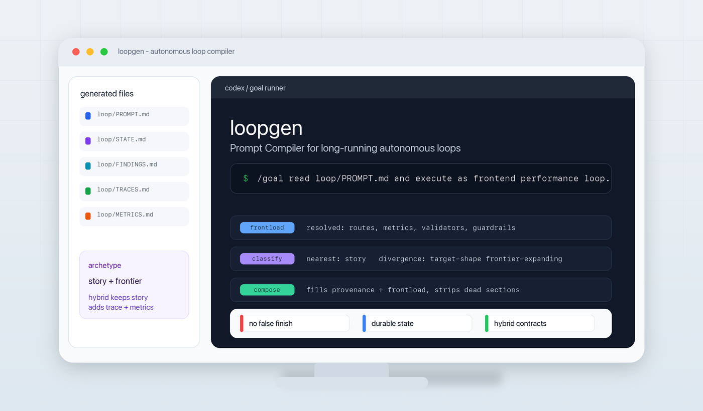

# loopgen

<p align="center"><strong>Prompt Compiler for creating long-running autonomous loops.</strong></p>

Your loop died 10 minutes after you went to sleep.

Not because the task was impossible. It blocked on a decision you could have made before it ever fired, or it declared victory on the first green-looking signal.

loopgen writes the part of the prompt that keeps that from happening.

Give it the thing you're trying to do: close a spec, improve the codebase, push a benchmark, walk a frontend, build a vague idea. It classifies the loop, writes the prompt + state + queue files, resolves the decisions that would stall the run, then hands you one `/goal` line. Paste it into Claude Code or Codex and let it run.

The visible output is intentionally boring:

```text
/goal read loop/PROMPT.md and execute as <loop identity>.
```



## Install

It's a skill. Send your agent the repo, or clone it and symlink `loopgen/` into the skill directory (`~/.claude/skills/` for Claude Code, `~/.codex/skills/` for Codex).

## How it actually works

loopgen is four battle-tested loop-generator skills folded into one compiler. It picks the shape from your intent, fills the blanks, creates canonical state, prompt, and queue files, then hands you the fixed `/goal` kickoff prompt.

### The four archetypes

loopgen classifies for you. When the intent sits between archetypes, it composes the active contracts instead of forcing the task into one box.

| Seed | Archetype | Halts on |
|---|---|---|
| A task with a definition of done | `goal` | `criteria-met`: one final-verify proves the frozen acceptance inventory |
| A frontier to push (autoresearch) | `frontier` | `homeostatic-checkpoint`: five homeostasis axes balanced, no intervention left |
| A product surface to walk through | `story` | `storyboard-converged`: the visible product matches the storyboard |
| An idea to build out from zero | `greenfield` | `stone-converged`: the artifact landed on the user's reframed target |

### How it composes

1. **Frontload audit.** Resolve every uncertainty the loop will need (motive, commands, paths, evaluator, scope) before composing. Unresolved items emit as a frontload preamble so you can close them before the loop fires.
2. **Classify.** Extract the intention's primitive values, score against each archetype's default bundle (weighted-Hamming over the varying axes), pick the nearest. A genuine tie is a hybrid; a contradiction (e.g. a `finite-criteria` target with an `equilibrium` halt) is a classification error → ask, never silently default.
3. **Compose.** Start from the archetype body, apply per-axis divergence patches, and fill the provenance + frontload slots. Overlays such as consult capability and benchmark-frontier are detected during frontload and do not add archetypes or change the weighted classifier.
4. **Emit.** Canonical artifacts plus one self-contained prompt and a fixed `/goal` kick-off.

Canonical artifacts are stable:

| Shape | Files |
|---|---|
| Common | `loop/PROMPT.md`, `loop/STATE.md` |
| `goal` | `loop/ACCEPTANCE.md`, `loop/VERIFY.md` |
| `frontier` | `loop/FINDINGS.md`, `loop/TRACES.md`, `loop/METRICS.md` |
| `story` | `docs/storyboard.md` |
| `greenfield` | `loop/RUBRIC.md`, `loop/INTENT.md`, `loop/README.md` |

Hybrids keep the nearest archetype's files, then add the active divergent or overlay contracts. For example, a story-shaped frontend performance loop keeps `docs/storyboard.md` and adds metric/trace indexes because the frontier-expanding target needs measurable before/after evidence.

The primitive vocabulary (the five axes the classifier scores on: target / halt / artifact / convergence / cadence; plus frontload overlays such as consult capability and benchmark-frontier, which affect composition rather than steering classification), the four archetype definitions, the assembler, and the four emittable bodies all live under [`loopgen/`](loopgen/SKILL.md).

### The archetypes, in full

#### [`goal`](loopgen/archetypes/goal.md)

You have a task with a definition of done. Closes a finite acceptance inventory and halts when one final-verify proves the whole list. A 1-row inventory is fine: one bug with a repro, one review finding, one spec line.

You have a spec with a dozen acceptance lines and you want them all green by morning. `/loopgen` derives a prompt that walks the inventory, fixes each, and halts on `criteria-met` once a single final pass proves the whole list. See [`loopgen/references/oracle-principles.md`](loopgen/references/oracle-principles.md) for the underlying principles (binary oracle, oracle independence, anti-theater).

#### [`frontier`](loopgen/archetypes/frontier.md)

You have a quality frontier to push — better, faster, more robust, higher-scoring — with no finish line, Karpathy's autoresearch style. A held-out benchmark score is one instance; so are latency, test coverage, type-safety, suite health, robustness, or "improve the codebase" once you've named the dimension. Each iteration senses the repo across five homeostasis axes, picks the intervention at the edge between what the artifact can already do and what it can't yet, runs it, scores it, and decides whether the frontier moved — alternating between improving the product and improving the mechanism that judges it. (A *finite* version of the same target — "get coverage to exactly 80% and stop" — has a pass line and is `goal`, not `frontier`; the frontier is the one with no fixed finish. Note: no finish line ≠ no stopping rule — a frontier loop still halts, at equilibrium / plateau / budget, just not at a target number.)

Your benchmark scores 0.71 and you want it to grind and auto-improve — or the test suite is slow and flaky and you want it faster and greener by morning, no fixed target, just better. `/loopgen` halts on `homeostatic-checkpoint` when all five homeostasis axes are in balance and no intervention is available, or `signal-starvation` when N consecutive iterations produce no new failing trace or finding.

Pure frontier records pressure status, pressure debt, checkpoint reason, and next pressure in `loop/FINDINGS.md`, `loop/TRACES.md`, `loop/METRICS.md`, and `loop/STATE.md`. When frontload binds a concrete benchmark/eval/harness object, loopgen adds the `benchmark-frontier` overlay: semantic roles for domain spec, benchmark, candidates, frontier, and traces; candidate lineage; evaluator health; and search/holdout/adversarial pressure before promotion. It is still `frontier`, not a fifth archetype.

#### [`story`](loopgen/archetypes/story.md)

You have a product's user-facing promises to walk through. A web frontend is the best-tooled instance, but a CLI, a TUI, or an API's published contract make promises too — the artifact of interest is the user-facing promise, not its code or its tests, and the evidence tracks the surface: screenshots for a frontend, a command transcript + exit code for a CLI, contract tests + schema for an API.

You shipped onboarding three weeks ago and the storyboard has drifted. Signed-out, signed-in, and post-trial each promise something; you don't know which still hold. `/loopgen` derives a prompt that picks the next story, gathers evidence across prompts, docs, code, and the observed UI, reconciles the row with what's there, and either implements it or records the gap. Halts on `storyboard-converged` when the visible product matches the storyboard within the current scope.

#### [`greenfield`](loopgen/archetypes/greenfield.md)

You have an idea to build out. No spec, no inventory, no evaluator — often an empty repo, but equally a brand-new subsystem inside an existing one. The failure mode is the inverse of `goal`'s: `goal` asks whether the list got closed; greenfield asks whether you ever committed to one.

The seed: "an artifact manager for my spec-driven workflow." You don't know what "it" is yet. `/loopgen` derives a prompt that names the artifact, builds the smallest scenario that proves it, and earns the next addition only when the current one holds. Halts on `stone-converged` when the artifact has landed on the user's reframed target and further iteration has no positive yield. The 11 green-field invariants live in [`loopgen/references/greenfield-invariants.md`](loopgen/references/greenfield-invariants.md).

---

It's a prompt-writer skill with strong opinions about going to sleep. That's all. YMMV.
